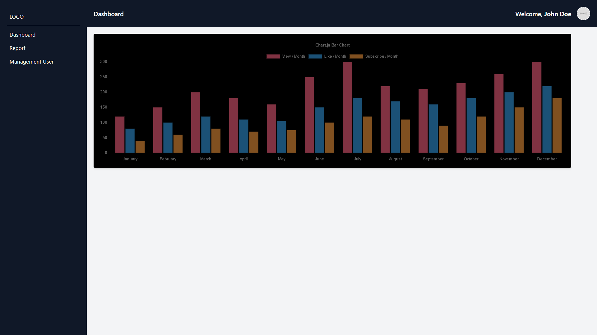
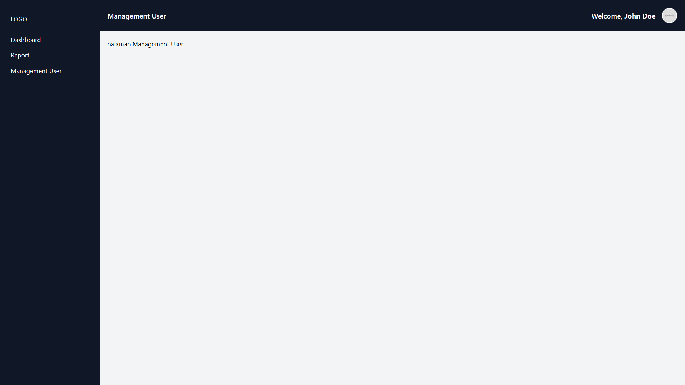
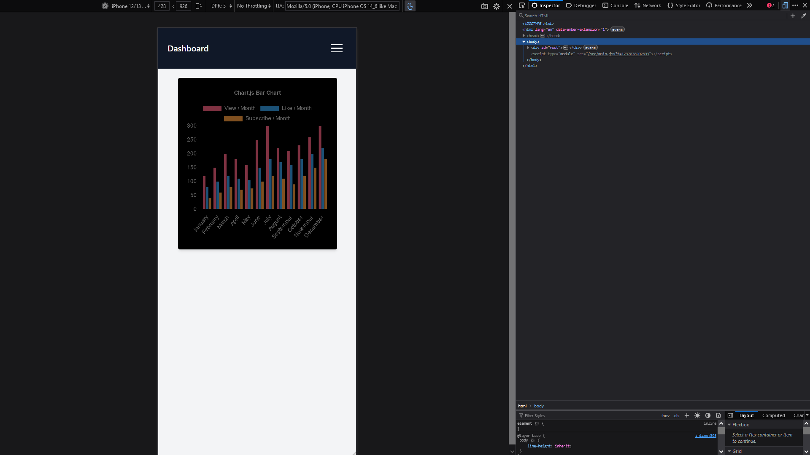
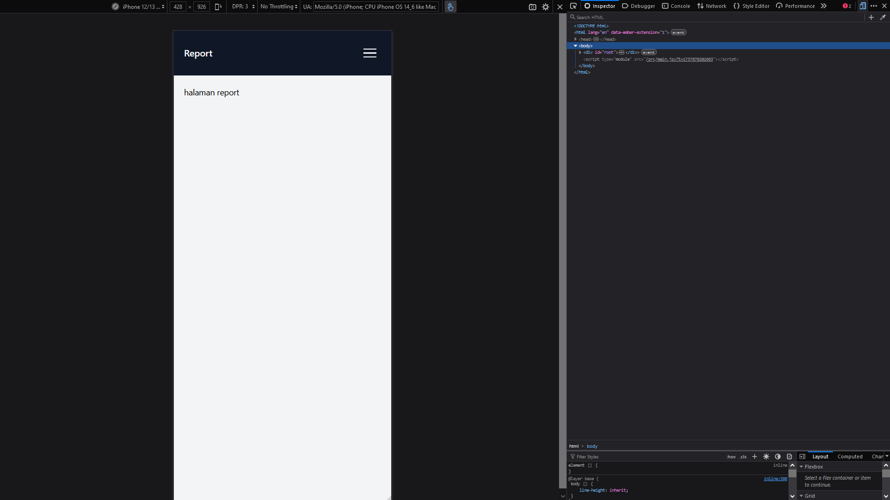
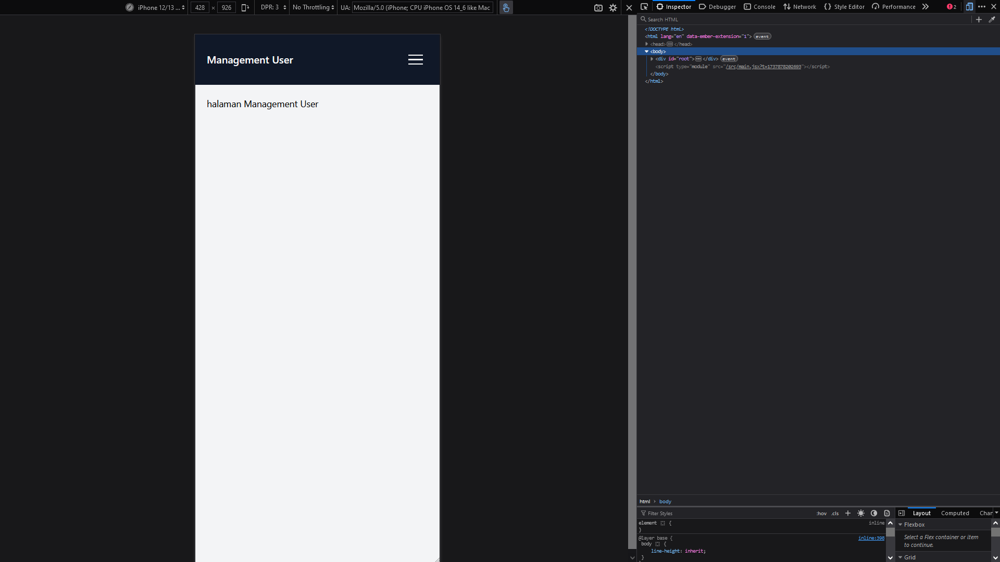
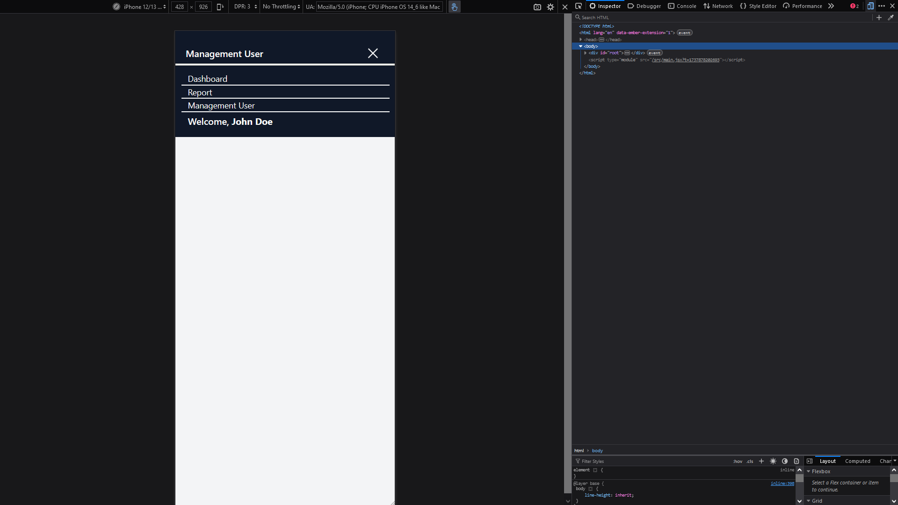

# Chart YOUTUBE API

Ini adalah project untuk menampilkan grafik menggunakan ChartJS dengan tech stack Tailwind CSS + React.

## Gambar Demo

### Berikut adalah picture project mode laptop / pc:

picture : 1


picture : 2


picture : 3


### Berikut adalah picture project mode mobile:

picture : 1


picture : 2


picture : 3


picture : 4


# Instalasi Project

### Clone Repository

1. Clone repository ini menggunakan Git dengan perintah berikut:

```bash
git clone https://github.com/Maniexie/chartjs-ddms.git
```

2. Masuk Ke Directory project

```bash
cd chartjs-ddms
```

3. Instal Dependecies & jalan project

```bash
npm install && npm run dev
```
